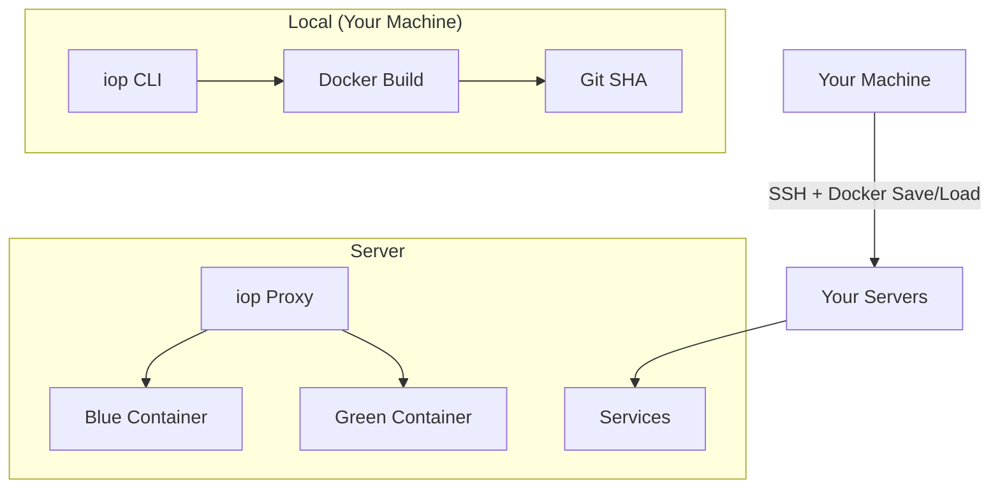
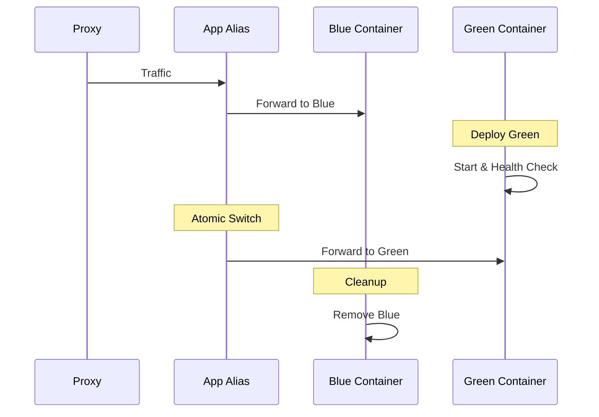
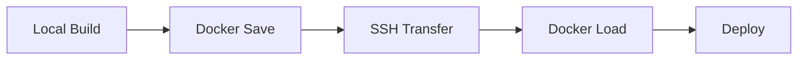

# Core Concepts

Understanding the key concepts behind iop will help you deploy with confidence and troubleshoot issues effectively.

## Philosophy

iop is built on a simple philosophy: **own your infrastructure without the complexity**. 

### No Rollback Commands Needed

Instead of complex rollback mechanisms, iop embraces Git as the source of truth:

- Want to rollback? Just `git checkout` the commit you want and run `iop` again
- Every deployment is tagged with the Git SHA for easy identification
- Rollbacks are just another deployment, using the same reliable process

## Architecture Overview



### Components

1. **iop CLI** (TypeScript) - Your local command-line tool
2. **iop Proxy** (Go) - Reverse proxy running on your servers
3. **Docker** - Container runtime (installed automatically if needed)

## Apps vs Services

iop treats different types of workloads differently to optimize for their use cases:

### Apps (Zero-Downtime)

**Apps** are user-facing applications that need zero-downtime deployments:

- ✅ Built locally and transferred via SSH
- ✅ Blue-green deployment strategy
- ✅ Health checks before traffic switching
- ✅ Automatic rollback on failure
- ✅ SSL termination and routing via proxy

**Examples**: Web applications, APIs, microservices

```yaml
apps:
  web:
    server: your-server.com # Single server per app
    build:
      context: .
      dockerfile: Dockerfile
    proxy:
      app_port: 3000
      hosts:
        - example.com
    health_check:
      path: /up
```

### Services (Direct Replacement)

**Services** are infrastructure components that can tolerate brief downtime:

- ✅ Use pre-built Docker images
- ✅ Direct container replacement
- ✅ Persistent volumes preserved
- ✅ Quick restart for updates

**Examples**: Databases, message queues, caches, monitoring tools

```yaml
services:
  postgres:
    image: postgres:17
    server: db.example.com
    ports:
      - "5432:5432"
    environment:
      secret:
        - POSTGRES_PASSWORD
    volumes:
      - postgres_data:/var/lib/postgresql/data
```

## Zero-Downtime Deployments (Blue-Green)

iop achieves zero-downtime deployments using a blue-green strategy with Docker network aliases:

### How It Works

1. **Current State**: Traffic flows to "blue" container via network alias
2. **New Deployment**: Start "green" container with new version
3. **Health Check**: Verify green container is healthy
4. **Atomic Switch**: Change network alias from blue to green
5. **Cleanup**: Remove old blue container



### Network Aliases

The magic happens with Docker network aliases:

- Both blue and green containers join the same Docker network
- Traffic is routed via a shared alias (e.g., `myapp-web`)
- Switching the alias is atomic and instant
- No external load balancer configuration needed

### Example Flow

```bash
❯ iop
Using Git SHA for release ID: a1b2c3d
[✓] Building new version (green)
[✓] Health checking green version
[✓] Switching traffic: blue → green
[✓] Stopping old version (blue)
```

## Registry-Free Deployment

Unlike most deployment tools, iop doesn't require Docker registries:

### Traditional Approach (with Registry)


### iop Approach (Registry-Free)


### Benefits

- **No registry costs** - Save money on Docker Hub Pro, ECR, etc.
- **No registry complexity** - No authentication, access control, or availability concerns
- **Better security** - Images never leave your control
- **Faster for small teams** - No registry bottlenecks

### How It Works

1. **Build locally**: `docker build -t myapp:sha123 .`
2. **Save to tar**: `docker save myapp:sha123 | gzip`
3. **Transfer via SSH**: `scp` or `rsync` over existing SSH connection
4. **Load on server**: `docker load` from the transferred tar
5. **Deploy**: Start containers using the loaded image

## Automatic Infrastructure Setup

iop automatically prepares your servers without separate "setup" commands:

### Fresh Server Bootstrap

When you run `iop` for the first time on a server, it automatically:

1. **Installs Docker** (if not present)
2. **Creates Docker networks** for app communication
3. **Deploys iop proxy** for SSL and routing
4. **Configures security hardening** (firewall, fail2ban)
5. **Sets up SSL automation** with Let's Encrypt

### No Separate Setup Command

Unlike other tools, iop doesn't require a separate `iop setup` command:

- Infrastructure setup happens automatically during deployment
- Servers are configured on first deployment
- Updates and changes are applied incrementally

## Proxy and SSL Management

The iop proxy is a lightweight Go application that handles:

### Reverse Proxy

- Routes incoming requests to the correct application containers
- Load balances between multiple replicas
- Handles SSL termination
- Provides health check endpoints

### SSL Certificate Management

- **Automatic certificate acquisition** via Let's Encrypt
- **Certificate renewal** (happens automatically before expiration)
- **Multiple domains** supported per application
- **Staging mode** available for development/testing

### HTTP to HTTPS Redirect

- Automatic HTTP to HTTPS redirects (configurable)
- HSTS headers for enhanced security
- Support for custom SSL configurations

```yaml
apps:
  web:
    proxy:
      hosts:
        - myapp.com
        - www.myapp.com
      ssl: true # Automatic HTTPS (default)
      ssl_redirect: true # HTTP to HTTPS redirect
```

## State Management

### Local State (Your Machine)

- **Configuration**: `iop.yml` and `.iop/secrets`
- **Git repository**: Source of truth for deployments
- **Docker images**: Built locally before deployment

### Server State

- **iop proxy state**: Stored in `/var/lib/iop-proxy/state.json`
- **Container state**: Managed by Docker
- **Volume data**: Persisted in Docker volumes
- **SSL certificates**: Stored by Let's Encrypt/proxy

### No Central Database

iop doesn't require a central database or control plane:

- Each server maintains its own state
- Configuration is distributed via SSH
- Git serves as the coordination mechanism
- Simpler architecture, fewer failure points

## Multi-Server Support

iop supports deploying across multiple servers:

### Deployment Strategy

- Each app/service instance targets a single server
- Multiple instances can target different servers
- Load balancing happens at the DNS/CDN level
- Each server runs independently

### Example Multi-Server Setup

```yaml
apps:
  web-us-east:
    server: us-east.example.com
    proxy:
      hosts:
        - us-east.myapp.com
  
  web-eu-west:
    server: eu-west.example.com
    proxy:
      hosts:
        - eu-west.myapp.com

  web-primary:
    server: primary.example.com
    proxy:
      hosts:
        - myapp.com
        - www.myapp.com
```

## Git-Based Releases

iop uses Git SHAs as release identifiers:

### Release ID Generation

- **Clean working directory**: Uses current Git SHA
- **Uncommitted changes**: Prompts to commit first
- **No Git repository**: Generates timestamp-based ID

### Docker Image Tagging

Images are tagged with the Git SHA:

```
my-app/web:a1b2c3d
my-app/api:a1b2c3d
```

### Benefits

- **Traceability** - Every deployment linked to specific code
- **Rollbacks** - Easy to identify and return to previous versions
- **Debugging** - Know exactly what code is running in production
- **Collaboration** - Team can see what's deployed via Git history

## Health Checks

Health checks are fundamental to zero-downtime deployments:

### How They Work

1. **New container starts** with your application
2. **Health check begins** (default: HTTP GET /up)
3. **Retries until healthy** (or timeout)
4. **Traffic switches** only after health check passes
5. **Old container removed** after successful switch

### Default Configuration

```yaml
apps:
  web:
    health_check:
      path: /up # Default endpoint
```

### Implementation Examples

```javascript
// Express.js health check
app.get('/up', async (req, res) => {
  try {
    // Check database connectivity
    await db.ping();
    
    // Check external dependencies
    await redis.ping();
    
    // All good!
    res.status(200).send('OK');
  } catch (error) {
    // Something's wrong, don't switch traffic
    res.status(503).send('Not ready');
  }
});
```

```go
// Go health check
http.HandleFunc("/up", func(w http.ResponseWriter, r *http.Request) {
    // Check dependencies
    if err := db.Ping(); err != nil {
        w.WriteHeader(http.StatusServiceUnavailable)
        return
    }
    
    w.WriteHeader(http.StatusOK)
    w.Write([]byte("OK"))
})
```

### Health Check Failures

If health checks fail:

- **No traffic switch** occurs
- **Old container keeps running** (zero downtime maintained)
- **New container is removed** automatically
- **Deployment marked as failed**
- **Detailed logs available** for debugging

## Scaling and Replicas

iop supports horizontal scaling via replicas:

### How Replicas Work

```yaml
apps:
  web:
    replicas: 3
    # ... other config
```

This creates:
- `myapp-web-blue-1`, `myapp-web-blue-2`, `myapp-web-blue-3`
- All containers share the same network alias
- Docker's built-in load balancing distributes requests
- Blue-green deployments work across all replicas

### Benefits

- **Higher throughput** - Multiple containers handle requests
- **Better reliability** - If one container fails, others continue
- **Rolling updates** - Can deploy one replica at a time
- **No external load balancer needed** - Docker handles it

## Networking

iop creates isolated Docker networks for container communication:

### Network Architecture

```
Internet → iop Proxy → Project Network → Your Apps & Services
```

### Automatic Service Discovery

Apps and services can communicate using their names:

```javascript
// In your app, connect to database service
const db = new Client({
  host: "postgres", // Service name from iop.yml
  port: 5432,
});
```

### Network Naming

- **Project network**: `{project-name}-network`
- **Container names**: `{project-name}-{app-name}-{color}` (for apps)
- **Service containers**: `{project-name}-{service-name}` (for services)

## Volume Management

iop handles volumes intelligently:

### Named Volumes

```yaml
volumes:
  - postgres_data:/var/lib/postgresql/data
```

- **Persistent across deployments** - Data survives container restarts
- **Managed by Docker** - No manual cleanup needed
- **Shared across replicas** - Multiple containers can access same volume

### Bind Mounts

```yaml
volumes:
  - ./config:/app/config:ro
```

- **Direct access to host filesystem** - Good for configuration files
- **Real-time updates** - Changes on host immediately visible in container
- **Use sparingly** - Can break containerization benefits

## Security Model

iop follows security best practices:

### SSH-Based Security

- Uses your existing SSH keys and access
- No additional authentication required
- Leverages proven SSH security model
- Works with SSH jump hosts, bastion servers, etc.

### Secrets Management

```bash
# .iop/secrets - stored locally, never transmitted in plain text
DATABASE_URL=postgres://...
API_KEY=secret-key
```

- Secrets stored locally in `.iop/secrets`
- Transmitted securely over SSH
- Available as environment variables in containers
- Never stored in logs or configuration files
- Automatically added to `.gitignore`

### Network Security

- **Minimal ports open** - Only 22 (SSH), 80/443 (HTTP/S), 8080 (proxy API)
- **Internal networks** - Containers communicate via private Docker networks
- **No external database** - All state stored locally on servers

### Automatic Security Hardening

When setting up fresh servers, iop automatically:

- Configures firewall rules
- Sets up fail2ban for SSH protection
- Configures non-root container execution
- Sets up automatic security updates

## Error Handling and Recovery

iop is designed to fail safely:

### Deployment Failures

- **Health check fails**: Old container keeps running
- **Build fails**: No deployment attempted
- **SSH fails**: Clear error message with suggestions
- **Resource constraints**: Graceful handling and cleanup

### Automatic Recovery

- **Proxy restarts**: Automatic container restart on failure  
- **Certificate renewal**: Automatic renewal before expiration
- **Container crashes**: Docker restart policies handle recovery

### Manual Recovery

- **Check status**: `iop status --verbose`
- **View logs**: `iop proxy logs`
- **Rollback**: `git checkout <previous-sha> && iop`

## Command Overview

iop provides four main commands:

### `iop init`
Initialize project configuration files (`iop.yml` and `.iop/secrets`)

### `iop` (Default: Deploy)
Deploy apps and services with automatic infrastructure setup

### `iop status`
Check deployment status across all servers with detailed information

### `iop proxy`
Manage the reverse proxy (status, update, logs, delete-host)

Understanding these concepts will help you design and deploy robust applications with iop. Each concept builds on the others to provide a complete, reliable deployment solution.