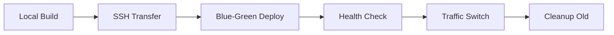

# iop: Ship Docker Anywhere ⚡

iop is a zero-downtime Docker deployment tool that lets you deploy any Docker application to your own servers with automatic HTTPS and no configuration complexity.

## Core Features

- ✅ **Zero-downtime blue-green deployments** - Apps deploy with no service interruption
- ✅ **Registry-free deployment** - Build locally, transfer via SSH (no Docker registry needed)
- ✅ **Automatic server setup** - Fresh server bootstrap with security hardening
- ✅ **Auto-SSL with Let's Encrypt** - HTTPS certificates managed automatically
- ✅ **Multi-server support** - Deploy across multiple servers with load balancing
- ✅ **Git-based releases** - Easy rollbacks by checking out previous commits
- ✅ **Health checks and automatic rollbacks** - Built-in reliability

## Quick Start

Get started with iop in just a few steps:

<Cards>
  <Card title='Installation' href='/installation' />
  <Card title='Your First Deployment' href='/quick-start' />
  <Card title='Configuration Reference' href='/configuration' />
  <Card title='Examples' href='/examples' />
</Cards>

## Philosophy

**No rollback commands needed** - just checkout the git commit you want and run `iop` again.

## Why Choose iop?

### vs Kamal (37signals)

- **TypeScript/Bun** instead of Ruby for better performance
- **Registry-free deployments** - no need for external Docker registries
- **Automatic server hardening** - security built-in from day one

### vs Vercel/Netlify

- **Your own servers** - full control, no vendor lock-in
- **Any Docker app** - not limited to specific frameworks
- **Cost-effective** - pay only for your servers, not per deployment
- **No cold starts** - your containers are always running

### vs Docker Compose

- **Zero-downtime deployments** - compose restarts cause downtime
- **Multi-server support** - deploy across multiple machines
- **Automatic SSL** and reverse proxy included
- **Git-based releases** and rollback capabilities

## Key Concepts

### Apps vs Services

iop distinguishes between two types of deployments:

- **Apps** - User-facing applications that get **zero-downtime blue-green deployments**
- **Services** - Infrastructure components (databases, caches) that get **direct replacement**

### Deployment Architecture



1. **Local Build** - Docker images built on your machine
2. **SSH Transfer** - Images compressed and sent via SSH (no registry)
3. **Blue-Green Deploy** - New version starts alongside old version
4. **Health Check** - New version validated before traffic switch
5. **Traffic Switch** - Atomic switch via network aliases
6. **Cleanup** - Old version containers removed

## Example Deployment

```bash
❯ iop
Using Git SHA for release ID: 9d8209a
Starting deployment with release 9d8209a

[✓] Configuration loaded (0ms)
[✓] Git status verified (3ms)
[✓] Infrastructure ready (1.2s)
[✓] Building Images (3.3s)
  └─ web → my-app/web:9d8209a
[✓] Deploying to Servers (4.2s)
  └─ 157.180.25.101
     ├─ [✓] Loading image (2.5s)
     ├─ [✓] Zero-downtime deployment (1.4s)
     └─ [✓] Configuring proxy (319ms)
[✓] Deployment completed successfully in 8.8s

Your app is live at:
  └─ https://test.eliasson.me
```

## Commands Overview

- **`iop init`** - Initialize iop.yml config and secrets file
- **`iop`** - Deploy apps and services (default command, auto-sets up infrastructure)
- **`iop status`** - Check deployment status across all servers
- **`iop proxy`** - Manage the reverse proxy (status, update, logs, delete-host)

## Get Started

Ready to deploy? Follow our [Quick Start guide](/quick-start) to deploy your first application with iop.